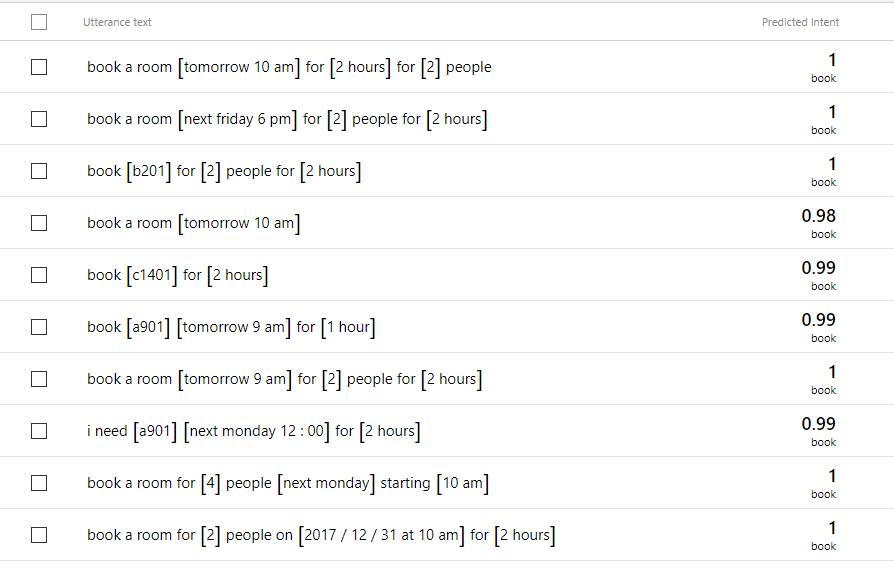
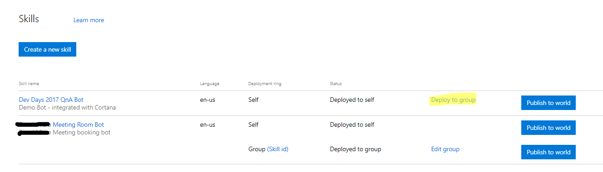

**Overview**
------------

**This document contains source codes and necessary steps to create and
demonstrate a meeting room booking chat bot.**

-   **use bot framework to create a chatbot**

-   **considerations when creating a chatbot for enterprise**

    -   **Timezone**

    -   **Conversation Log**

    -   **Dialog Box Control**

    -   **User Cancel Conversation**

    -   **Monitoring**

-   **This Bot supports Azure AD authentication mechanism**

-   **Cortana Channel**

**Cortana Skill currently supports only US Market, and not all languages are
supported by Cortana. So the following steps are targeting English. You can
change supported language by changing your LUIS model.**

**This Document does not contain Implementation details of Meeting Room API.**

**Prerequisites**
-----------------

-   **Microsoft Account(\@Hotmail.com、\@Msn.COM…etc)**

-   **Cortana Enabled Windows 10 devices (for Cortana Skill Only)**

-   **An Active AZure Subscription**

-   **Visual Studio 2015 or 2017 (Community+)**

**Required Cortana User consent**
---------------------------------

-   **User NAme**

-   **User Email**

-   **Geo-Location**

-   **User Profile**

**Designing a Chatbot**
-----------------------

#### Reference

-   AutoBot: <https://github.com/MicrosoftDX/AuthBot>

-   Meeting Room Bot Sample Code:
    <https://github.com/michael-chi/meetingroombotdemo>

#### Business Requirements

-   To allow users book a meeting room with the following utterance

Book A901 tomorrow at 10 am for 1 hour

I need A902 next Monday at 10 am for 2 hours

-   Or, allow user provide meeting details to allow Meeting Room API search an
    available room for the user

I need a room next Friday at 10 am

Book a room next Friday at 10 am for 1 hour for 2 people

-   If user has a preferred meeting room, the Chatbot check if the room is
    available at specified time.

    -   If it is available, book the room

    -   If it is not available, tell the user room is not available

-   If user did not specify preferred room

    -   And he provided complete meeting information such as time, duration,
        capacity…etc

        -   The Chatbot search for available room that meets criteria and let
            user choose one.

    -   If user did not provide complete information

        -   The Chatbot collects all required information and allow user to
            choose one.

#### Flow chat

#### Bot Design considerations

Users may provide full information in his first utterance, but also can provide
only part of meeting information. So we will divide our conversation with users
into several different dialog boxes

-   MainDialog: Greeting users and identify what information are already
    included user’s utterances as well as unprovided required information.

-   DetailDialog: Collect required information

-   ConfirmDialog: Invoke Meeting Room API. If the room is confirmed booked,
    display a summary of the meeting to the user as well as provide a iCS file
    for users to download.

##### Design

-   Collect required meeting room information

    -   In order to book a meeting room, we need the following information

        -   (Optional)MeetingRoomID

        -   Meeting Date

        -   Meeting Start Time

        -   Attendee size (Optional if user specified MeetingRoomId)

        -   Meeting Duration

    -   We anticipate users may use following utterance to book meeting rooms

        -   Book A901 next Monday at 10 am for 2 hours

        -   Book a room tomorrow at 10 am for 1 hour for 2 people

        -   Book a room next Monday at 10 Am

        -   Book A902 for 1 hour

        -   I need a room at next Friday 5 PM

    -   If we need to collect additional information from users, in
        DetailDialog, we anticipate user use exact words to provide information,
        such as:

>   Bot: How many people would attend this meeting in person

>   User: 10

>   But not utterances like below

>   Bot: How many people would attend this meeting in person

>   User: There’re 10 people would attend this meeting

Although the later method is more close to nature, but this kind of free type
answer would make our program complicated. Generally speaking, we focus on
fulfill user’s needs – in this case – book a meeting room – in our first phase.
And in later phases we try to make our Chatbot more intelligent.

-   FormFlow or LuisDialog

Bot Framework provide many ways to collect information from users. Most people
may choose to use LUIS(Language Understanding Intelligence Service). Some may
choose FormFlow, or mix of botth.

Considering of above conversation flow, we use LUIS in MainDialog, and use
prompt dialog to collect additional information

-   Bot Dialog Control

    -   In Bot Framework, you an use IDialogContext::Forword() to “forward”
        user’s input to next dialog box. Or, sometimes you use
        IDialogContext::Call() to “invoke” another dialog to handle conversation
        with users

        -   Forware, as the name suggests, “forward” user’s input to next dialog
            box. The dialog box receives whatever user said in it’s
            MessageReceived() method.

        -   Call, on the other hands, does not receives user’s input. It waits
            until user says something else.

    -   A dialog box call invoke next dialog, the later dialog can invoke
        another dialog. This forms a Dialog stack. It is important to manage
        dialog stack. Do invoke IDialogContext::Done() to complete current
        dialog box when you’ve done conversation with the user. When necessary,
        invoke IDialogContest::Reset() to reset all dialog stack.

-   Authentication/Authorization

    -   In this sample, we integrated with Azure AD. If your company has Office
        365 and has implemented hybrid integration, then you can still use the
        same way to authenticate users against Azure AD.

        -   In this sample, we use AuthBot that is developed by Microsoft TED
            team to help us simplified Azure AD authentication:
            <https://github.com/MicrosoftDX/AuthBot>

-   Timezones

    -   Users use their preferred IM app to communicate with our chatbot such as
        Skype, Slack…etc – which, in most case, are set to local timezone. When
        a user says “book a room tomorrow at 10 am”. The chatbot must be able to
        handle what “tomorrow” means correctly.

    -   LUIS

        -   Azure timezone defaults to UTC. LUIS as well. In LUIS, you can
            specify your preferred timezone in REST API URL while invoking LUIS
            API.

[https://westus.api.cognitive.microsoft.com/luis/v2.0/apps/{model-id}?subscription-key={subscription-key}&timezoneOffset=480&verbose=true&q=book%20a%20room%20tomorrow%2010%20am](https://westus.api.cognitive.microsoft.com/luis/v2.0/apps/%7bmodel-id%7d?subscription-key=%7bsubscription-key%7d&timezoneOffset=480&verbose=true&q=book%20a%20room%20tomorrow%2010%20am)

-   If in Bot Framework you did not invoke LUIS API directly but uses
    LuisDialog, you can override ModifyLuisRequest to add additional query
    parameters to final URL.

protected override LuisRequest ModifyLuisRequest(LuisRequest request)

{

request.ExtraParameters =

>   "timezoneOffset=" +

>   this.TimezoneOffset?.TotalMinutes.ToString();

return request;

}

-   Bot Builder SDK

    -   Bot Builder SDK 3.8.2 added a new property in Activity class called
        “localtimestamp”. When your app supports, this property has the local
        time in user’s device. However, not all app supports this property, you
        may still need some way to collect time zone information from users.

        -   One way is to request geo-location from client devices then convert
            to time zone.

        -   The other way can be ask users to provide time zone information.

    -   In this sample, considering of cross-timezoen users. We leave LUIS
        timezone setting as UTC. We will check if localtimezone has value, if so
        we use localtimezone as user’s local timezone. Otherwise we read
        timezone from web.config

-   Conversation Logs

    -   We implement IActivityLog interface to log conversation history. General
        speaking we group each conversation by conversationId property. In some
        client App, the conversationId wouldn’t change.

-   User cancel/terminate conversation

    -   Image that while booking a meeting room, user may somehow change his
        mind and want to abort current conversation, or jump to another topic.
        We need a mechanism to allow users to “abort” from current conversation.

>   In Bot Framework, we implement IScorable interface and register global
>   message handler to archive this.

-   System monitoring

    -   Bot itself is just a REST API, we can leverage Application Insights to
        collect general activity logs. We can also implement our own custom
        matric and events to collect required information.

>   Once those information sent into Application insights, we can connect them
>   to PowerBi to create our dashboard.

Implementation
--------------

### Create and register Bot

-   login to <https://dev.botframework.com> with your Microsoft account
    (outlook.com, msn.com…etc)

-   Create and register Bot

    -   In test and developmet phase, you can set Bot API url to
        <https://localhost:3990/api/messages>

    -   When deployed your bot to Azure, you must change the url to

-   The registration process creates an app in App portal. Please record the App
    password, it only be shown once.

-   You should see your bot listed after creation

-   Now, login to <https://apps.dev.microsoft.com/#/appList> with your MSA
    account

-   Find the newly registered Bot，ex, AuthBotDemo

-   Click on AuthBotDemo，and enter the configuration page，add a new platform

-   Add new Web platform

-   Set Redirect URL to <https://www.bing.com/agents/auth>

-   If you want to use Cortana and other channels at same time, set redirect url
    to Bot’s OAuthCallback URL

-   If our meeting room is integrated with Office 365, we can use Microsoft
    Graph API to search available rooms and book rooms. In that case, we need to
    request delegate permission as below.

-   Save settings

### Cortana Channel Settings

-   Login to <https://dev.botframework.com> with your MSA account

-   Enable Cortana Channel

-   Client ID and Client Secret are App Id and Password you generated in above
    steps.

Authorization Url and Token Url as below

-   Configure scope as：User.Read offline_access openid。

-   Configure Credentia as below

-   Request user profile data

-   Save

### LUIS model design

-   We use LUIS to identify user’s intents and entities. Beside meeting room
    information, in order to better identify time and date, we use built-in LUIS
    datetimeV2 entity to help us understand user’s utterance. Here we create two
    intents – book and ans_datetime.

    -   Book: meeting room booking intent

    -   Ans_datetime: used in customize prompt dialog for users to input date
        time such as tomorrow, next Monday…etc

-   Create below entities in LUIS

    -   datetimeV2 is the meeting date and time

    -   roomid is the room id, if we have a meeting room id list, we can
        configure it as a “list” entity and manually inputs all room ids.

    -   Size is the number of attendees of this meeting.

-   Intent

-   ans_date

-   Book

### Implement Bot Application Authentication mechanism

Source Code：<https://github.com/michael-chi/meetingroombotdemo>

Below we only explain some important parts of the codes.

-   To add AuthBot to our project

    -   Open Meeting Room Bot project, add Autorest NUGET package

    -   In Meeting Room Bot project, add Authbot NUGET package

-   Cortana channel can use Connected Service to authenticate users. When using
    connected service, every messages sent from Cortana app to Bot contains an
    JWT token in“AuthenticationToken” entity in its message body. By parsing the
    token we have user’s credential and information.

-   Download and add AuthBot project to Meeting Room Bot solution, then remove
    AuthBot’s assembly reference from Meeting Room Bot projet.

-   Then add Authbot project as a reference in Meeting Room Bot project.

-   We need to check if use has logged in when he send messages to our bot. we
    do this by checking a flag in BotState. AuthBot automatically does this for
    us. However, Authbot does not support Cortana’s connected service
    AutenticationToken yet. So we will need to add some codes to it.

-   Open ContextExtension.cs in Authbot project, add a new method
    GetCortanaAccessToken()

private static string GetCortanaAccessToken(IBotContext context)

{

string token = string.Empty;

Activity activity = context.Activity as Activity;

if (activity.ChannelId.Equals("cortana",

>   StringComparison.InvariantCultureIgnoreCase))

{

var msg = activity as IMessageActivity;

{

var tokenEntity = msg.AsMessageActivity().Entities.Where(e =\>
e.Type.Equals("AuthorizationToken")).SingleOrDefault();

if (tokenEntity == null)

{

//Debug mode

token = string.Empty;

}

else

{

token = tokenEntity?.Properties.Value\<string\>("token");

}

}

}

else

{

token = string.Empty;

}

return token;

}

-   Modify existing GetAccessToken() method, add Cortana channel checks

if (context.Activity.ChannelId.Equals("cortana",

>   StringComparison.InvariantCultureIgnoreCase))

{

string token = null;

if (context.UserData.TryGetValue(ContextConstants.AuthResultKey,

>   out authResult))

{

//we have credential

}

else

{

token = GetCortanaAccessToken(context);

var jwt = new JwtSecurityToken(token);

authResult.AccessToken = token;

long tick = long.MinValue;

long.TryParse(jwt.Payload.Claims.Where(

>   c =\> c.Type.Equals("exp",

>   StringComparison.InvariantCultureIgnoreCase))

>   .SingleOrDefault()?.Value, out tick);

authResult.ExpiresOnUtcTicks = tick;

InMemoryTokenCacheMSAL tokenCache =

>   new InMemoryTokenCacheMSAL(Encoding.ASCII.GetBytes(token));

authResult.TokenCache = tokenCache.Serialize();

context.StoreAuthResult(authResult);

}

return authResult.AccessToken;

}

-   When user is on other channels like Skype or Slack, we will use Authbot to
    handle user login. Once user successfully logged in. Azure AD will callback
    to the registered URL ( FQDN}/api/OAuthcallback}. In this handler, Authbot
    extracts user information and store in BotState.

-   In Visual Studio, open Meeting Room Bot project and open settings.config,
    you’ll see below settings.

\<appSettings\>

\<!-- update these with your BotId, Microsoft App Id and your Microsoft App
Password--\>

\<add key="BotId" value="YourBotId" /\>

\<add key="MicrosoftAppId" value="{your app id}" /\>

\<add key="MicrosoftAppPassword" value="your password" /\>

\<add key="StorageName" value="storage account"/\>

\<add key="StorageKey" value="storage key"/\>

\<add key="MeetingRoomApiUrl" value="meeting api url"/\>

\<add key="LuisModel" value="luis model id"/\>

\<add key="LuisKey" value="luis key"/\>

\<add key="ActiveDirectory.Mode" value="v2" /\>

\<add key="ActiveDirectory.Scopes" value="User.Read Calendars.Read
Calendars.Read.Shared Calendars.ReadWrite Calendars.ReadWrite.Shared" /\>

\<add key="ActiveDirectory.EndpointUrl"
value="https://login.microsoftonline.com" /\>

\<add key="ActiveDirectory.Tenant" value="common" /\>

\<add key="ActiveDirectory.ClientId" value="{your app id}" /\>

\<add key="ActiveDirectory.ClientSecret" value=" your password " /\>

\<add key="ActiveDirectory.RedirectUrl"
value="https://localhost:3990/api/OAuthCallback" /\>

\</appSettings\>

-   Here you need to change MicrosoftAppId and ActiveDirectory.ClientId to the
    newly registered Bot Id

-   Change MicrosoftAppPassword and ActiveDirectory.ClientSecret to the password
    you generated in registration process

-   ActiveDirectory.RedurectUrl Is the call back url that Azure AD invokdes
    after user successfully login to Azure AD; you can use a local url such as
    <https://localhost:3990/api/OAuthCallback>during test and development phase.
    Once deployed to the cloud, you need to change this configuration to cloud
    url

-   Change LuisModel and LuisKey to newly created Luis App id and App key

-   Change Storage Account and Storage Key. We will store ics file in the
    storage for users to download.

-   You can leave other configuration settings as is.

-   Add below codes to Global.aspx.cs so that Authbot reads configuration
    settgins from settigns.config

AuthBot.Models.AuthSettings.Mode =
ConfigurationManager.AppSettings["ActiveDirectory.Mode"];

AuthBot.Models.AuthSettings.EndpointUrl =
ConfigurationManager.AppSettings["ActiveDirectory.EndpointUrl"];

AuthBot.Models.AuthSettings.Tenant =
ConfigurationManager.AppSettings["ActiveDirectory.Tenant"];

AuthBot.Models.AuthSettings.RedirectUrl =
ConfigurationManager.AppSettings["ActiveDirectory.RedirectUrl"];

AuthBot.Models.AuthSettings.ClientId =
ConfigurationManager.AppSettings["ActiveDirectory.ClientId"];

AuthBot.Models.AuthSettings.ClientSecret =
ConfigurationManager.AppSettings["ActiveDirectory.ClientSecret"];

AuthBot.Models.AuthSettings.Scopes =
ConfigurationManager.AppSettings["ActiveDirectory.Scopes"].Split(' ');

### Handle Cortana channel’s user info

-   In Cortana channel, we can request Cortana to send user’s geo-location to
    Bot. This information is stored in an UserInfo entity and will be sent to
    the Bot in every messages

{

"type": "UserInfo",

"Name": {

"GivenName": "GivenName",

"FamilyName": "FamileName"

},

"Email": "xxxx\@msn.com",

"Location": {

"StartTime": "2017-06-18T05:37:05Z",

"EndTime": "2017-06-18T13:51:57Z",

"Hub": {

"Id": "xxxx-xxxx-4404-9652-77b4e95a2ac3",

"Type": "Home",

"Name": "home",

"Latitude": 225.0225,

"Longitude": 221.0221,

"Address": "Some Addresses"

},

"VenueName": "",

"Away": false

}

},

### Conversation log and User abort

-   In Global.aspx.cs, we register ActiveLog and Global Message Handler with the
    following codes

var builder = new ContainerBuilder();
builder.RegisterType\<CancelScorable\>().AsImplementedInterfaces().InstancePerLifetimeScope();
builder.RegisterType\<ActivityLogger\>().AsImplementedInterfaces().InstancePerDependency();

builder.Update(Conversation.Container);

-   We implement ActivityLogger.cs to log conversations. In this sample we send
    conversation to Application Insights via its SDK

public async Task LogAsync(IActivity activity)

{

if (activity.ChannelData != default(dynamic))

{

Trace.TraceInformation("[Channel Data]" +
JsonConvert.SerializeObject(activity).Replace(Environment.NewLine, ""));

}

try

{

var tokenEntity = activity.AsMessageActivity().Entities.Where(e =\>
e.Type.Equals("AuthorizationToken")).SingleOrDefault();

var token = tokenEntity?.Properties?.Value\<string\>("token");

if (token != null)

{

var jwt = new JwtSecurityToken(token);

var log = string.Join(" \| ", jwt.Payload.Claims.ToArray().Select(c =\> c.Type +
":" + c.Value).ToArray());

Trace.TraceInformation("[Token]" + log);

}

}

catch(Exception exp)

{

Trace.TraceError(\$"[Exception]{exp.ToString()}");

}

-   Also we implement CancelScorable.cs to handle user cancel by detecting the
    keyword “cancel”

protected override async Task\<string\> PrepareAsync(IActivity item,
CancellationToken token)

{

var message = item as IMessageActivity;

if (message != null && !string.IsNullOrWhiteSpace(message.Text))

{

if (message.Text.Trim().Equals("cancel",
StringComparison.InvariantCultureIgnoreCase))

{

return "cancel";

}

}

return null;

}

### Detecting missing information

-   In MainDialog.cs, we created a field “RequiredParameters” to track required
    information field names.

public readonly string[] RequiredParameters = new string[]

{

"size","startDate","startTime","duration"

};

-   In book intent handler, we check provided information via LUIS. In our case,
    if use provided roomId, then size is not required

var duration = TryFindEntity(result, "builtin.datetimeV2.duration",

>   "duration")?.SingleOrDefault();

var startDateTime = TryFindEntity(result, "builtin.datetimeV2.datetime",

>   "datetime")?.ToArray().FirstOrDefault();

var startDate = TryFindEntity(result, "builtin.datetimeV2.date",

>   "date")?.ToArray().FirstOrDefault();

var startTime = TryFindEntity(result, "builtin.datetimeV2.time",

>   "time")?.ToArray().FirstOrDefault();

var roomId = TryFindEntity(result, "roomid")?.SingleOrDefault();

var size = TryFindEntity(result, "size")?.SingleOrDefault();

bool requireMoreInfo = false;

requireMoreInfo = (startDateTime == null && startTime == null) \|\|

(size == null && roomId == null) \|\|

(duration == null);

-   Then we collect additional information required, and send required
    information to DetailDialog by calling IDialogContext::Forward()

await context.Forward\<object\>(new DetailInfoDialog()

{

RequiredInformation = queue,

StartDate = startDate?.ToDateTime(TimezoneOffset),

StartTime = startTime == null ?

>   startDateTime?.ToDateTime(TimezoneOffset) :

>   startTime?.ToDateTime(TimezoneOffset),

Duration = duration?.ToTimeSpan(),

Size = size?.ToInt64(),

RoomId = roomId?.Entity,

Offset = TimezoneOffset

},

ResumedFromDetailForm,

(Microsoft.Bot.Connector.Activity)context.Activity);

-   Once we have all information, we forward information to ConfirmDialog

private async Task Book(IDialogContext context, DetailInfoDialog detail)

{

var confirmDialog = new BookingConfirmDialog(

>   new MeetingRoomSuggestionConstrain

{

Attendees = new List\<string\> { Requestor },

Location = detail.RoomId,

Start = detail.StartTime.Value.DateTime,

End =

>   detail.StartTime.Value.DateTime

>   .AddMinutes(detail.Duration.Value.TotalMinutes),

Size = (int)(detail.Size.HasValue ? detail.Size.Value : 0),

MeetingOrganizer = Requestor,

>   MeetingRoomIds = string.IsNullOrEmpty(detail.RoomId) ? null :  
>   new string[] { detail.RoomId },

LocationDisplayNames = null,

TimezoneOffset = TimezoneOffset

});

await context.Forward\<object\>(confirmDialog,

>   ResumedFromConfirmationDialog,

>   context.Activity.AsMessageActivity());

}

-   Here we use Forward instead of Call because we want to DetailDialog to
    handle user’s input immediately without waiting for another user input.

-   Once we collected all required information in DetailDialog, we pass all
    information back to its caller - MainDialog

if (StartDate.HasValue && StartTime.HasValue)

{

StartTime = new DateTimeOffset(StartDate.Value.Year,

>   StartDate.Value.Month,

>   StartDate.Value.Day,

>   StartTime.Value.Hour,

>   StartTime.Value.Minute,

>   StartTime.Value.Second,

>   StartTime.Value.Offset);

}

ctx.Done\<object\>(this);

-   If we are collecting date and time, we use PromptDialog to collect those
    information. We implemented our own TimeRelatedPromptDialog to help us
    collect those information. This dialog will invoke LUIS and check
    ans_datetime intent to get date and time

TimeRelatedPromptDialog.cs

LuisService luis = new LuisService(new LuisModelAttribute(

modelID: ConfigurationManager.AppSettings["LuisModel"],

subscriptionKey: ConfigurationManager.AppSettings["LuisKey"],

apiVersion: LuisApiVersion.V2

));

-   override TryParse() to check if it is valid date/time

protected override bool TryParse(IMessageActivity message, out string result)

{

result = ((Activity)message).Text;

T item = Task.Run(() =\> GetResultDate(((Activity)message).Text)).Result;

bool hasResult = false;

if (EqualityComparer\<T\>.Default.Equals(item, default(T)))

{

result = null;

hasResult = false;

}

else

{

Result = item;

OnCompleted?.Invoke(Result);

hasResult = true;

}

return hasResult;

}

-   Finally, when we booked a room. The bot generates an vCalendar file for user
    to download. And summarize meeting info to the user via a HeroCard.

**Deploy**
----------

### Cortana Channel

-   In testing phase, you publish Cortana Skill to users through Cortana
    Management Dashboard

-   Selected user will receive an invitation, once user click the link included
    in the invitation, Cortana skill should be deployed and associated with his
    MSA

-   User can check Cortana Skill in Cortana -\> Notebook -\> Skills

-   Once you deploy the Cortana Skill world-wide, everyone can searchyou’re your
    skill at <https://www.microsoft.com/en-us/windows/cortana/cortana-skills/>

### **Bot in Action**

### **Skype Channel**

**Cortana Skill**
-----------------

-   Wake up Cortana，And say “tell Meeting Room Hi”，or “Ask Meeting Room book a
    room tomorrow” to connect to Cortana Skill

-   Cortana will require you to login if this is the first time you use the
    skill. Input your Azure AD credential to login

